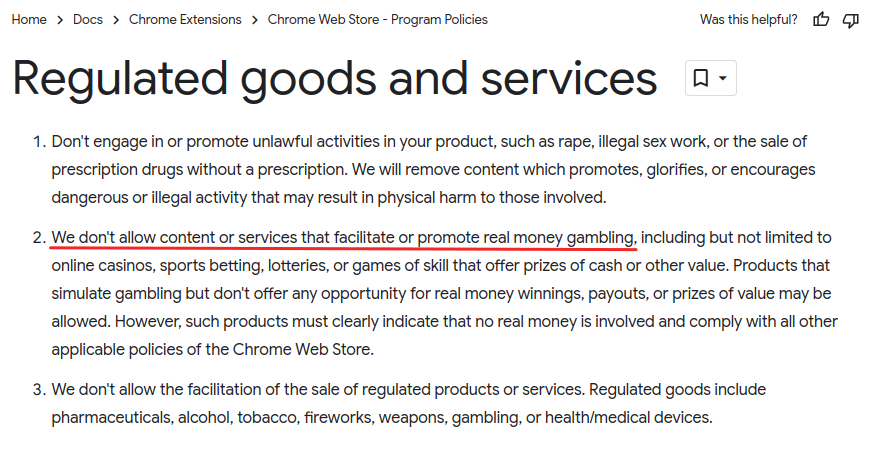

# Jackpot Sniper #
Jackpot Sniper is the ultimate tool for online casino players. It tracks progressive jackpots, identifies the optimal time to play and automatically places minimal bets to maximize your chances of winning the jackpot.

## How to get Jackpot Sniper ##
Jackpot Sniper is essentially a Chrome extension and Chrome extensions are usually installed from the Chrome Web Store. However, Google isn’t a big fan of gambling and so they strictly refuse any gambling related extensions or software on their Google Web Store.

That’s a bit disappointing but there’s a way to get around it and you've got two options: **the geeky one** and **the easy one**

### Option 1: The Geeky way ###
This option involves some manual work and doesn't support auto updates which means you'll be missing out when support for new games is added.

- download the latest extension zip from releases on this page
- extract zip anywhere in your home folder, eg. *c:\Users\Thomas\jackpot-sniper*
- start Chrome with an additional parameter, eg. `chrome.exe --load-extension c:\Users\Thomas\jackpot-sniper`
- you might also update your desktop shortcut and add the parameter in there
- before you can start Chrome with the extension you need to close all existing Chrome windows (not tabs)

You might also start Chrome in a dedicated user profile by passing parameter `--user-data-dir`

### Option 2: The Easy way ###
The easy way is to get a small [launcher](https://github.com/jackpotsniper/launcher)
 which does everything described in the previous option and it also updates the extension if a newer version is available.
